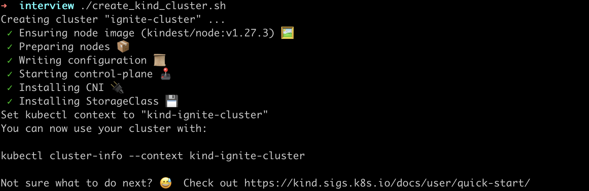

# Ignite DevOps Intern Task

## Setup
1. Clone this repository
    ```
    git clone https://github.com/ileriayo/ignite-task.git
    ```

2. Navigate into the repo directory (folder)
    ```
    cd ignite-task
    ```

3. Create a Kind cluster by exectuing the following script
    ```
    ./create_kind_cluster.sh
    ```
    The result will be that a new Kind cluster has been created. See screenshot below:

    

4. Grab the kubeconfig file by running the following command
    ```
    kind get kubeconfig --name ignite-cluster > kubeconfig.yaml
    ```
    The command above saves the kubeconfig to a file named `kubeconfig.yaml`

5. Install the node application dependencies by running the following command in the `node_application`` dir3ctory
    
    ```
    cd node_application && npm i
    ```
    `Note`: You can test the application by simply executing `npm start` within the node_application dir

6. Build and deploy a docker image to dockerhub from the node_app dir
    ```
    docker buildx build . -t <dockerhub-username>/<image-name>
    ```
    For example: `docker buildx build . -t ileriayo/ignite`
    Once that is done, login to dockerhub and verify that it exists

7. Navigate to the terraform directory and execute the following commands:
    
    a. Init 
    ```
    terraform init
    ```

    b. Plan
    ```
    terraform plan
    ```
    
    b. Apply
    ```
    terraform apply
    ```
    